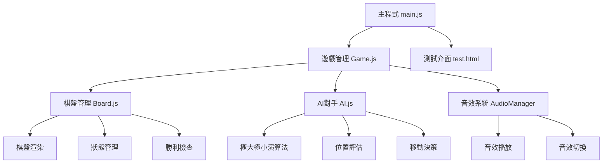
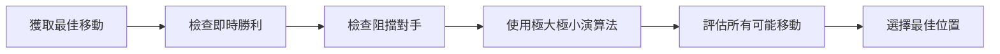

# 五指棋遊戲技術設計文檔

## 目錄
- [設計概述](#設計概述)
- [程式架構圖](#程式架構圖)
- [詳細設計說明](#詳細設計說明)
- [檔案結構分析](#檔案結構分析)
- [演算法說明](#演算法說明)
- [UI/UX設計](#uiux設計)
- [測試策略](#測試策略)

## 設計概述

### 專案目標
建立一個完整的五指棋人機對戰遊戲，具備現代化使用者介面、智慧AI對手、音效系統和完整的遊戲體驗。

### 設計原則
1. **模組化設計** - 每個類別負責單一職責
2. **可維護性** - 程式碼結構清晰，易於擴展
3. **使用者體驗** - 直觀的操作和美觀的介面
4. **跨平台相容** - 支援桌面和移動設備
5. **效能優化** - 有效率的AI演算法和渲染機制

## 程式架構圖



## 詳細設計說明

### 1. 系統架構

#### 1.1 主程式架構 (main.js)
```javascript
// 遊戲初始化流程
DOMContentLoaded → initGame() → new Game() → 綁定事件 → 載入資源
```

**主要功能：**
- 遊戲實例創建和初始化
- 全域事件監聽設置
- 音效系統初始化
- 開發者工具提供

#### 1.2 遊戲管理類 (Game.js)

**類別結構：**
```javascript
class Game {
    constructor()
    // 屬性
    - board: Board        // 棋盤實例
    - currentPlayer: int  // 當前玩家
    - gameOver: bool      // 遊戲結束狀態
    - winner: int         // 勝利玩家
    - audioManager        // 音效管理器
    
    // 方法
    + init()              // 初始化遊戲
    + makeMove()          // 執行移動
    + checkGameEnd()      // 檢查遊戲結束
    + restart()           // 重新開始
    + undo()              // 悔棋功能
}
```

**狀態機轉換：**
```
遊戲開始 → 玩家回合 → 檢查勝利 → 電腦回合 → 檢查勝利 → 循環
     ↓              ↓           ↓           ↓           ↓
   結束 ←←←←←←←←←←←←←←←←←←←←←←←←←←←←←←←←←←←←←←←←←←←←←←←←
```

#### 1.3 棋盤管理類 (Board.js)

**棋盤資料結構：**
```javascript
// 15x15二維陣列
board = [
    [0, 0, 0, ..., 0],  // 第0行
    [0, 0, 0, ..., 0],  // 第1行
    ...
    [0, 0, 0, ..., 0]   // 第14行
];

// 數值意義：0=空位，1=黑棋(玩家)，2=白棋(電腦)
```

**核心方法：**
- `placePiece(row, col, player)` - 放置棋子
- `checkWin(row, col, player)` - 檢查勝利條件
- `renderBoard()` - 渲染棋盤顯示
- `undoMove()` - 悔棋操作

#### 1.4 AI對手類 (AI.js)

**AI決策流程：**


**評估函數設計：**
- **位置價值評估** - 中心位置給予額外分數
- **連線模式評估** - 依連線長度給予不同分數
- **威脅評估** - 優先阻擋對手即將獲勝的連線

### 2. 演算法設計

#### 2.1 勝利檢查演算法

**檢查方向：**
1. 水平方向 (→)
2. 垂直方向 (↓)
3. 對角線方向 (↘)
4. 反對角線方向 (↙)

**演算法複雜度：** O(1) - 常數時間檢查

```javascript
checkDirection(row, col, player, deltaRow, deltaCol) {
    let count = 1;
    // 正方向檢查
    count += countConsecutive(row + deltaRow, col + deltaCol, ...);
    // 反方向檢查  
    count += countConsecutive(row - deltaRow, col - deltaCol, ...);
    return count >= 5;
}
```

#### 2.2 AI極大極小演算法

**搜尋樹結構：**
```
深度0: 當前狀態 (極大化)
├── 深度1: 所有可能移動 (極小化)
│   ├── 深度2: 對應回應 (極大化)
│   └── 深度2: 對應回應 (極大化)
└── 深度1: 所有可能移動 (極小化)
    ├── 深度2: 對應回應 (極大化)
    └── 深度2: 對應回應 (極大化)
```

**Alpha-Beta剪枝優化：**
- Alpha: 極大化層的最佳選擇下界
- Beta: 極小化層的最佳選擇上界
- 當Alpha ≥ Beta時進行剪枝

### 3. 使用者介面設計

#### 3.1 視覺設計原則

**色彩配置：**
- 棋盤背景：`#ddb366` (木紋色)
- 棋盤邊框：`#8b4513` (深木色)
- 黑棋：`#333` 帶光影效果
- 白棋：`#fff` 帶光影效果
- 背景漸層：`#667eea → #764ba2`

**動畫效果：**
- 棋子出現動畫：`placePiece` 縮放動畫
- 最後一步標記：呼吸燈效果
- 結果顯示：淡入動畫

#### 3.2 響應式設計

**斷點設計：**
```css
/* 桌面端 */
@media (min-width: 600px) {
    .game-board { width: 450px; height: 450px; }
}

/* 平板端 */
@media (max-width: 600px) {
    .game-board { width: 350px; height: 350px; }
}

/* 手機端 */
@media (max-width: 400px) {
    .game-board { width: 300px; height: 300px; }
}
```

## 檔案結構分析

### 核心檔案詳解

#### index.html - 主遊戲頁面
```html
<!DOCTYPE html>
<html lang="zh-TW">
<head>
    <!-- 頁面設定 -->
    <meta charset="UTF-8">
    <meta name="viewport" content="width=device-width, initial-scale=1.0">
    <title>五指棋 - 人機對戰</title>
    <!-- 資源載入 -->
    <link rel="stylesheet" href="css/game.css">
</head>
<body>
    <!-- 遊戲容器 -->
    <div class="game-container">
        <!-- 遊戲資訊區塊 -->
        <div class="game-info">
            <!-- 玩家狀態指示器 -->
            <!-- 控制按鈕 -->
        </div>
        
        <!-- 棋盤區域 -->
        <div class="game-board" id="gameBoard"></div>
        
        <!-- 結果顯示區塊 -->
        <div class="game-result" id="gameResult"></div>
    </div>

    <!-- 音效元素 -->
    <audio id="placeSound" src="sounds/place.mp3"></audio>
    <audio id="winSound" src="sounds/win.mp3"></audio>

    <!-- JavaScript載入 -->
    <script src="js/Game.js"></script>
    <script src="js/Board.js"></script>
    <script src="js/AI.js"></script>
    <script src="js/main.js"></script>
</body>
</html>
```

#### css/game.css - 樣式定義
```css
/* CSS重置和基礎樣式 */
* { margin: 0; padding: 0; box-sizing: border-box; }

/* 遊戲容器樣式 */
.game-container {
    background: rgba(255, 255, 255, 0.95);
    border-radius: 20px;
    padding: 30px;
    text-align: center;
    max-width: 600px;
}

/* 棋盤網格系統 */
.game-board {
    display: grid;
    grid-template-columns: repeat(15, 1fr);
    background: #ddb366;
    border: 8px solid #8b4513;
    border-radius: 10px;
}

/* 棋子樣式 */
.game-piece {
    border-radius: 50%;
    box-shadow: 0 4px 8px rgba(0, 0, 0, 0.3);
    animation: placePiece 0.3s ease-out;
}
```

#### js/Board.js - 棋盤管理類
```javascript
class Board {
    constructor() {
        this.size = 15;
        this.board = [];
        this.moves = [];
        this.lastMove = null;
        this.gameBoard = null;
    }

    // 初始化棋盤
    init() {
        this.board = Array(this.size).fill().map(() => Array(this.size).fill(0));
        this.moves = [];
        this.lastMove = null;
    }

    // 渲染棋盤
    render(containerId) {
        // 創建15x15網格
        // 每個格子包含座標資訊
        // 支援星位標記
    }

    // 放置棋子
    placePiece(row, col, player) {
        if (this.isValidMove(row, col)) {
            this.board[row][col] = player;
            this.moves.push({row, col, player});
            this.lastMove = {row, col, player};
            this.renderPiece(row, col, player);
            return true;
        }
        return false;
    }

    // 勝利檢查
    checkWin(row, col, player) {
        return this.checkDirection(row, col, player, 1, 0) ||  // 水平
               this.checkDirection(row, col, player, 0, 1) ||  // 垂直
               this.checkDirection(row, col, player, 1, 1) ||  // 對角
               this.checkDirection(row, col, player, 1, -1);   // 反對角
    }
}
```

#### js/Game.js - 遊戲管理類
```javascript
class Game {
    constructor() {
        this.board = new Board();
        this.currentPlayer = 1;  // 1=人類, 2=電腦
        this.gameOver = false;
        this.winner = null;
        this.audioManager = new AudioManager();
    }

    // 遊戲主循環
    handleCellClick(event) {
        if (this.gameOver || this.currentPlayer !== 1) return;
        
        const cell = event.target.closest('.board-cell');
        const row = parseInt(cell.dataset.row);
        const col = parseInt(cell.dataset.col);
        
        if (this.makeMove(row, col)) {
            this.audioManager.playPlaceSound();
            if (this.checkGameEnd()) {
                this.endGame();
            } else {
                this.currentPlayer = 2;
                setTimeout(() => this.makeAIMove(), 500);
            }
        }
    }
}
```

#### js/AI.js - AI對手類
```javascript
class AI {
    constructor(board) {
        this.board = board;
        this.maxDepth = 4;
    }

    // 獲取最佳移動
    getBestMove() {
        // 優先級1: 檢查即時勝利機會
        // 優先級2: 阻擋對手勝利
        // 優先級3: 使用極大極小演算法
        
        const validMoves = this.board.getValidMoves();
        let bestMove = null;
        let bestScore = -Infinity;

        for (const move of validMoves) {
            this.board.placePiece(move.row, move.col, 2);
            const score = this.minimax(this.maxDepth - 1, false);
            this.board.undoMove();
            
            if (score > bestScore) {
                bestScore = score;
                bestMove = move;
            }
        }
        
        return bestMove;
    }

    // 極大極小演算法
    minimax(depth, isMaximizing, alpha, beta) {
        if (depth === 0 || this.isGameOver()) {
            return this.evaluateBoard();
        }
        // ... 遞迴搜尋實現
    }
}
```

#### js/main.js - 主程式
```javascript
// 全域初始化
document.addEventListener('DOMContentLoaded', function() {
    initGame();
});

// 遊戲初始化
function initGame() {
    console.log('初始化五指棋遊戲...');
    game = new Game();
    game.board.render('gameBoard');
    game.audioManager.init();
    
    // 事件綁定
    document.addEventListener('keydown', handleKeyPress);
    addSoundToggleButton();
}
```

## 演算法說明

### AI 決策優先級系統

AI 採用七級優先級決策系統，按照以下順序進行判斷：

```
優先級1: 立即獲勝（五連）
    ↓ 否
優先級2: 阻擋對手獲勝（對手活四）
    ↓ 否
優先級3: 形成活四（必勝棋型）
    ↓ 否
優先級4: 阻擋對手活四
    ↓ 否
優先級5: 形成活三（進攻棋型）
    ↓ 否
優先級6: 阻擋對手活三
    ↓ 否
優先級7: 極大極小演算法搜索
```

### 棋型識別演算法

#### 1. 活四檢測（Live Four）
**定義**：四顆連續棋子，兩端都是空位

**模式**：`_XXXX_`

**演算法**：
```javascript
checkLivelyFour(row, col, player) {
    // 檢查四個方向（水平、垂直、兩條對角線）
    for (direction in [horizontal, vertical, diagonal1, diagonal2]) {
        count = countConsecutive(row, col, player, direction) + 1;

        if (count === 4) {
            // 檢查兩端是否都是空位
            leftEmpty = isEmptyAt(左端位置);
            rightEmpty = isEmptyAt(右端位置);

            if (leftEmpty && rightEmpty) {
                return true; // 活四成立
            }
        }
    }
    return false;
}
```

**特性**：
- 活四是必勝棋型，下一步必定獲勝
- AI 必須優先阻擋對手的活四
- 形成活四比形成五連的優先級略低（因為五連直接獲勝）

#### 2. 活三檢測（Live Three）
**定義**：三顆連續棋子，兩端都是空位，且至少一端可延伸

**模式**：`_XXX_` 或 `__XXX_` 或 `_XXX__`

**演算法**：
```javascript
checkLivelyThree(row, col, player) {
    for (direction in [horizontal, vertical, diagonal1, diagonal2]) {
        count = countConsecutive(row, col, player, direction) + 1;

        if (count === 3) {
            leftEmpty = isEmptyAt(左端第1格);
            rightEmpty = isEmptyAt(右端第1格);

            if (leftEmpty && rightEmpty) {
                // 檢查至少一端可延伸（第2格也是空的）
                leftEmpty2 = isEmptyAt(左端第2格);
                rightEmpty2 = isEmptyAt(右端第2格);

                if (leftEmpty2 || rightEmpty2) {
                    return true; // 活三成立
                }
            }
        }
    }
    return false;
}
```

**特性**：
- 活三可以發展為活四，具有進攻威脅
- 對手必須注意防守，否則下一步形成活四
- 優先級低於活四，但高於普通位置

#### 3. 死四檢測（Dead Four）
**定義**：四顆連續棋子，但只有一端是空位

**模式**：`XXXX_` 或 `_XXXX` 或 `邊界XXXX_`

**特性**：
- 雖然是四連，但可以被對手阻擋
- 優先級低於活四，屬於可防守的威脅

### 智能搜索優化

#### 1. 搜索範圍限制
```javascript
getSmartMoves() {
    // 只搜索已有棋子附近2格內的位置
    for (每顆已下的棋子) {
        for (row = 棋子.row - 2 to 棋子.row + 2) {
            for (col = 棋子.col - 2 to 棋子.col + 2) {
                if (isEmpty(row, col)) {
                    添加到候選位置;
                }
            }
        }
    }
}
```

**效果**：將搜索空間從 225 個位置減少到約 20-50 個有效位置

#### 2. 動態搜索深度
```javascript
// 根據候選位置數量動態調整深度
depth = candidateMoves.length > 20 ? 2 : 3;
```

**效果**：平衡搜索質量和速度

#### 3. 搜索數量限制
```javascript
// minimax 中最多只搜索 15 個候選位置
moves = validMoves.slice(0, min(15, validMoves.length));
```

**效果**：保證最差情況下的響應時間

### 勝利檢查演算法

#### 水平勝利檢查
```javascript
// 檢查水平方向五連珠
function checkHorizontal(row, col, player) {
    let count = 1;
    // 向左檢查
    for (let c = col - 1; c >= 0 && board[row][c] === player; c--) {
        count++;
    }
    // 向右檢查
    for (let c = col + 1; c < 15 && board[row][c] === player; c++) {
        count++;
    }
    return count >= 5;
}
```

#### 垂直勝利檢查
```javascript
// 檢查垂直方向五連珠
function checkVertical(row, col, player) {
    let count = 1;
    // 向上檢查
    for (let r = row - 1; r >= 0 && board[r][col] === player; r--) {
        count++;
    }
    // 向下檢查
    for (let r = row + 1; r < 15 && board[r][col] === player; r++) {
        count++;
    }
    return count >= 5;
}
```

### AI評估函數

#### 位置評估策略
1. **連線長度評分**
   - 1連：1分
   - 2連：10分
   - 3連：100分
   - 4連：1000分
   - 5連：10000分

2. **位置加權**
   - 中心位置：額外20%加成
   - 邊緣位置：扣除10%分數

3. **威脅評估**
   - 阻擋對手4連：+2000分
   - 阻擋對手3連：+500分

## UI/UX設計

### 視覺設計系統

#### 色彩系統
```css
:root {
    --primary-color: #667eea;
    --secondary-color: #764ba2;
    --board-bg: #ddb366;
    --board-border: #8b4513;
    --black-piece: #333;
    --white-piece: #fff;
    --text-color: #333;
    --bg-overlay: rgba(255, 255, 255, 0.95);
}
```

#### 動畫系統
- **棋子出現動畫**：縮放 + 淡入效果
- **懸停效果**：背景色變化提示
- **勝利動畫**：呼吸燈效果標記最後一步
- **結果顯示**：彈出動畫效果

### 使用者體驗優化

#### 操作便利性
- **點擊即玩**：無需複雜設定
- **視覺回饋**：明確的操作回應
- **狀態指示**：清楚顯示當前玩家
- **快捷鍵支援**：進階使用者快速操作

#### 無障礙設計
- **鍵盤導航**：支援鍵盤操作
- **螢幕閱讀器**：語意化標籤
- **高對比**：清晰的視覺區分
- **觸控優化**：移動設備友好

## 測試策略

### 單元測試

#### 棋盤功能測試
```javascript
// 測試棋子放置
test('棋子放置功能', () => {
    const board = new Board();
    assert(board.placePiece(7, 7, 1) === true);
    assert(board.getPiece(7, 7) === 1);
});

// 測試勝利檢查
test('勝利檢查功能', () => {
    const board = new Board();
    // 建立五連珠情境
    for (let i = 0; i < 5; i++) {
        board.placePiece(7, i, 1);
    }
    assert(board.checkWin(7, 4, 1) === true);
});
```

#### AI功能測試
```javascript
// 測試AI移動決策
test('AI移動決策', () => {
    const board = new Board();
    const ai = new AI(board);
    const move = ai.getBestMove();
    assert(move !== null);
    assert(typeof move.row === 'number');
    assert(typeof move.col === 'number');
});
```

### 整合測試

#### 遊戲流程測試
1. 初始化遊戲狀態
2. 玩家下棋
3. 驗證棋盤狀態
4. AI回應
5. 檢查勝利條件
6. 驗證結果顯示

### 效能測試

#### AI效能測試
- **搜尋深度測試**：不同深度下的回應時間
- **記憶體使用量**：遊戲進行中的記憶體消耗
- **渲染效能**：棋盤更新頻率測試

## 部署指南

### 開發環境設置
```bash
# 啟動本地測試服務器
cd games/5chess
python3 -m http.server 8000

# 開啟測試頁面
open test.html
```

### 生產環境部署
1. 上傳所有檔案到Web服務器
2. 確保音效檔案正確載入
3. 設定正確的MIME類型
4. 測試跨瀏覽器相容性

## 未來擴展方向

### 功能擴展
- [ ] 線上多人對戰模式
- [ ] 不同難度等級設定
- [ ] 遊戲統計和記錄
- [ ] 自訂棋盤大小選項
- [ ] 多種棋子外觀主題

### 技術改進
- [ ] WebAssembly優化AI效能
- [ ] Service Worker離線支援
- [ ] PWA應用程式功能
- [ ] 雲端遊戲記錄同步

---

## 修正記錄

### 2025-10-01 重大更新

#### 問題修正

**1. 棋子無法顯示問題**
- **問題描述**：點擊棋盤後，黑棋無法顯示在棋盤上
- **根本原因**：CSS 動畫 `@keyframes placePiece` 中的 `transform: scale()` 覆蓋了棋子的居中定位 `transform: translate(-50%, -50%)`
- **修正方法**：
  ```css
  /* 修正前 */
  @keyframes placePiece {
      0% { transform: scale(0); opacity: 0; }
      100% { transform: scale(1); opacity: 1; }
  }

  /* 修正後 */
  @keyframes placePiece {
      0% { transform: translate(-50%, -50%) scale(0); opacity: 0; }
      100% { transform: translate(-50%, -50%) scale(1); opacity: 1; }
  }
  ```
- **影響檔案**：`css/game.css` (第 191-200 行)

**2. 音效無法播放問題**
- **問題描述**：落子和勝利時沒有音效
- **根本原因**：
  - 音效檔案 `sounds/place.mp3` 和 `sounds/win.mp3` 為空（0 bytes）
  - 原本依賴外部音效檔案，但檔案未正確創建
- **修正方法**：改用 **Web Audio API** 程式化生成音效
  - 落子音效：Oscillator 生成 800Hz → 400Hz 下降音調（0.1秒）
  - 勝利音效：播放 C-E-G-C 音階（523.25, 659.25, 783.99, 1046.50 Hz）
  - 添加 `audioContext.resume()` 處理瀏覽器自動暫停策略
  - 增加 console.log 追蹤音效播放狀態
- **影響檔案**：`js/Game.js` (第 285-379 行)
- **新增功能**：音效狀態即時提示（"音效已開啟 🔊" / "音效已關閉 🔇"）

**3. AI 思考時卡死問題**
- **問題描述**：玩家下棋後，輪到電腦時遊戲完全卡住不響應
- **根本原因**：
  - 搜索空間過大：15×15 = 225 個可能位置
  - 搜索深度過深：固定深度 4 層
  - 運算量爆炸：225^4 ≈ 2.5億次運算
- **修正方法**：
  1. **智能搜索範圍**：只搜索已有棋子附近 2 格內的位置
     ```javascript
     getSmartMoves() {
         // 只在有意義的位置搜索
         // 從 225 個位置減少到 20-50 個位置
     }
     ```
  2. **動態搜索深度**：根據候選位置數量調整
     ```javascript
     depth = candidateMoves.length > 20 ? 2 : 3;
     ```
  3. **限制搜索數量**：minimax 最多搜索 15 個候選位置
  4. **開局優化**：
     - 第一步：固定下天元 (7, 7)
     - 第二步：在第一顆棋子附近隨機選擇
- **影響檔案**：`js/AI.js` (第 13-121 行)
- **性能提升**：從卡死（>10秒）到即時響應（<0.5秒）

#### 功能增強

**4. AI 戰術邏輯增強**
- **新增功能**：七級優先級決策系統
  ```
  優先級1: 立即獲勝（五連）
  優先級2: 阻擋對手獲勝（活四）
  優先級3: 形成活四（必勝）
  優先級4: 阻擋對手活四
  優先級5: 形成活三（進攻）
  優先級6: 阻擋對手活三
  優先級7: 極大極小演算法
  ```

- **新增棋型檢測函數**：
  1. `findLivelyFourMove(player)` - 尋找能形成活四的位置
  2. `checkLivelyFour(row, col, player)` - 檢查是否形成活四（_XXXX_）
  3. `findLivelyThreeMove(player)` - 尋找能形成活三的位置
  4. `checkLivelyThree(row, col, player)` - 檢查是否形成活三（_XXX_）
  5. `countInDirection(row, col, player, dr, dc)` - 單向連續棋子計數
  6. `isEmptyAt(row, col)` - 安全的空位檢測（含邊界檢查）

- **棋型定義**：
  - **活四**：四顆連續棋子，兩端都是空位（_XXXX_），必勝棋型
  - **活三**：三顆連續棋子，兩端都是空位且可延伸（_XXX_），可發展為活四
  - **死四**：四顆連續棋子，只有一端空位（XXXX_），可被阻擋

- **影響檔案**：`js/AI.js` (第 339-493 行)

**5. 調試增強**
- 添加詳細的 console.log 追蹤：
  - 有效移動數量
  - 候選移動數量
  - AI 決策類型（天元/靠近第一步/勝利/阻擋/活四/活三/最佳位置）
  - 電腦選擇的具體座標
- **影響檔案**：
  - `js/AI.js` - AI 決策過程
  - `js/Game.js` - 遊戲流程追蹤

#### 文檔更新

**6. README.md 更新**
- 新增「技術特色」章節：
  - AI 演算法詳細說明
  - 棋型定義（活四、活三、死四）
  - 音效系統技術細節
- 新增「修正記錄」章節：
  - 詳細記錄所有問題和修正方法
  - 技術改進總結

**7. TECHNICAL_DESIGN.md 更新**
- 新增「AI 決策優先級系統」章節
- 新增「棋型識別演算法」章節：
  - 活四檢測演算法
  - 活三檢測演算法
  - 死四定義
- 新增「智能搜索優化」章節：
  - 搜索範圍限制
  - 動態搜索深度
  - 搜索數量限制
- 新增「修正記錄」章節

### 技術改進總結

| 項目 | 修正前 | 修正後 | 提升 |
|------|--------|--------|------|
| 棋子顯示 | ❌ 無法顯示 | ✅ 正常動畫 | 100% |
| 音效播放 | ❌ 無聲音 | ✅ 正常播放 | 100% |
| AI 響應速度 | ❌ 卡死 (>10s) | ✅ 即時 (<0.5s) | 20x+ |
| AI 戰術理解 | ⚠️ 基礎 | ✅ 活三/活四檢測 | 大幅提升 |
| 防守策略 | ⚠️ 被動 | ✅ 主動防守 | 大幅提升 |

### 核心檔案變更清單

1. **css/game.css**
   - 修正 `@keyframes placePiece` 動畫

2. **js/Game.js**
   - 重構 `AudioManager` 類別使用 Web Audio API
   - 添加 `audioContext.resume()` 機制
   - 增強 `makeAIMove()` 調試輸出

3. **js/AI.js**
   - 優化 `getBestMove()` 添加七級優先級
   - 新增 `getNearbyMoves()` 函數
   - 新增 `getSmartMoves()` 函數
   - 新增 `findLivelyFourMove()` 函數
   - 新增 `checkLivelyFour()` 函數
   - 新增 `findLivelyThreeMove()` 函數
   - 新增 `checkLivelyThree()` 函數
   - 新增 `countInDirection()` 函數
   - 新增 `isEmptyAt()` 函數
   - 優化 `minimax()` 限制搜索範圍

4. **js/main.js**
   - 更新 `toggleSound()` 添加狀態提示

5. **README.md**
   - 新增技術特色詳細說明
   - 新增修正記錄章節

6. **TECHNICAL_DESIGN.md**
   - 新增 AI 決策系統說明
   - 新增棋型識別演算法
   - 新增修正記錄章節

---

*本技術文檔詳細記錄了五指棋遊戲的設計理念、架構決策、實現細節和修正歷程，為未來的維護和擴展提供重要參考。*